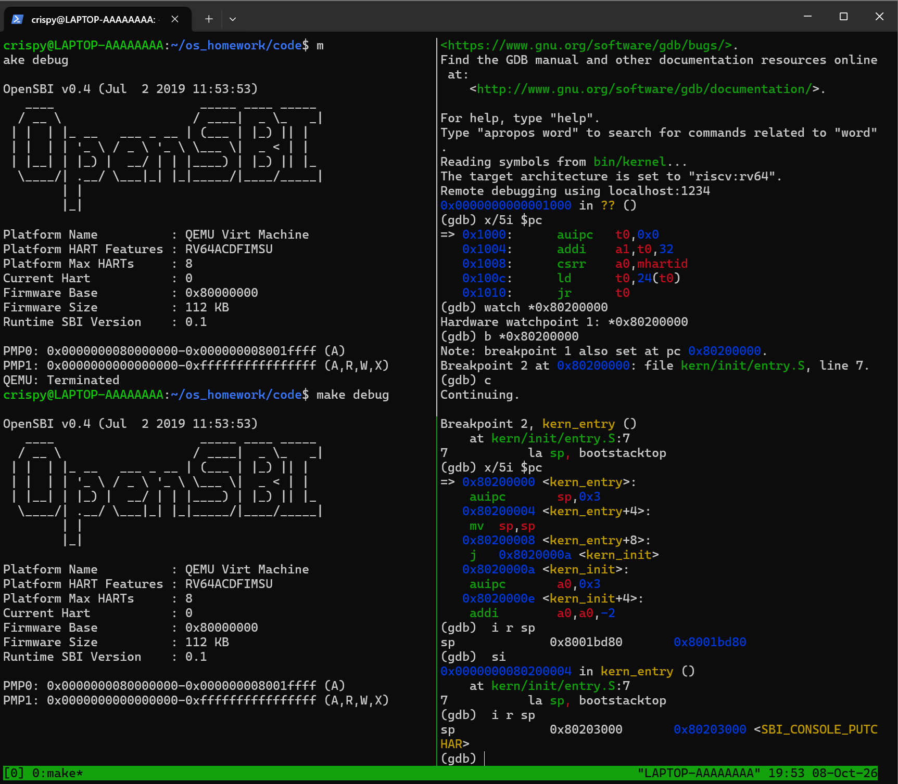

# 操作系统实验报告

## 实验基本信息

| 项目 | 内容 |
|------|------|
| 实验名称 | Lab 1: 比麻雀更小的麻雀（最小可执行内核）|
| 小组成员 | 2411795-阎科霖、2411294-王烨、2411276-林靖然 |
| 完成日期 | 2026-10-07 |

---

### 小组分工

练习分工：

| 成员 | 负责的练习/模块 |
|------|----------------|
| 2411795-阎科霖 | [练习或模块名称] |
| 2411294-王烨 | [练习或模块名称] |
| 2411276-林靖然 | [练习或模块名称] |

实验报告分工：[填写：谁负责撰写/校对哪一节]

---

## 一、实验目的

本实验的主要目的是：

1. 使用链接脚本描述内存布局
2. 进行交叉编译生成可执行文件，进而生成内核镜像
3. 使用 QEMU 预加载内核镜像，理解复位代码经 OpenSBI 移交控制权到内核的过程
4. 使用OpenSBI提供的服务，在屏幕上格式化打印字符串用于以后调试

---

## 二、实验环境

### 2.1 实验环境搭建及验证

按照实验指导书lab0的说明，搭建实验环境。本实验基于WSL2 Ubuntu 22.04 LTS开展，从oslab拉取lab1的代码后，我们寄存在目录`os_homework/code`下。

本次实验需要安装 RISC-V 工具链和模拟器 QEMU。**RISC-V 工具链** 用于交叉编译：开发环境运行在 x86 主机上，目标内核运行在 RISC-V 架构上，因此需要 riscv64 工具链。**QEMU** 用软件模拟一台 riscv64 计算机，并提供默认 **OpenSBI** 固件。本工程由 QEMU 在虚拟 CPU 开始执行前准备固件并预加载内核镜像；OpenSBI 在 CPU 上执行初始化，然后把控制权交给内核。镜像预加载与固件移交执行权是两个步骤。

而lab1的代码是 ucore 的麻雀骨架，即一个最小可执行内核。它把完整 ucore 中与本章无关的部分全部削去，只保留跑通启动链路所必需的部件。本章的代码运行起来只做一件事：打印一行 `(THU.CST) os is loading ...`，然后进入死循环。

以下安装步骤、用户名和工具链版本保留小组原实验环境的记录，不能与后面的独立 QEMU 4.1.1 复测会话合并；本轮报告修订没有执行这些配置命令。

首先是 RISC-V 工具链的安装。从 https://github.com/sifive/freedom-tools/releases 找到并下载与操作系统匹配的版本，解压后统一放到一个目录中。随后，我们设置 RISC-V 环境变量：

```bash

mkdir -p ~/riscv
vim ~/.bashrc

#跳转至最后一行
export RISCV=$HOME/riscv
export PATH=$RISCV/bin:$PATH

#保存退出，随后应用
source ~/.bashrc
echo $RISCV

#输出结果正确，环境变量生效
/home/sparkwang/riscv
```

环境变量配置生效后，执行以下命令验证工具链是否可用：

```bash
riscv64-unknown-elf-gcc -v

#输出结果正确，安装完成
gcc version 10.2.0 (SiFive GCC-Metal 10.2.0-2020.12.8)
```

随后从Qemu官方网站获取qemu-4.1.1，解压后执行：

```bash
cd qemu-4.1.1
./configure --target-list=riscv32-softmmu,riscv64-softmmu --extra-cflags="-fcommon"
make -j$(nproc)

#验证版本
qemu-system-riscv64 --version

#输出结果正确，安装完成
QEMU emulator version 4.1.1
Copyright (c) 2003-2019 Fabrice Bellard and the QEMU Project developers
```

至此，实验基本环境搭建完成。

**补充：已有 QEMU 4.1.1 复测记录的环境与证据**

本轮修订日期为 2026-10-09，基于刚同步的 `lab1` 提交 `9f247af`，没有重新运行实验。练习 2 主要引用此前保存的独立版本自动复测日志，作为已有实测证据；原三张截图仍属于小组原实验会话。后续人工复现与截图应另记会话、版本和实际结果。

| 项目 | 原报告会话 | 已保存的独立版本复测 |
|------|------------|--------------------|
| 系统 | WSL2 Ubuntu 22.04 | WSL2 Ubuntu 22.04 |
| Lab1 交叉 GCC | SiFive 10.2.0 | 15.1.0 |
| GDB | 原连接截图为 10.1 | 16.3.90.20250610-git |
| QEMU | 原安装记录为 4.1.1 | `/home/collin/opt/qemu-4.1.1/bin/qemu-system-riscv64`，4.1.1 |
| OpenSBI / Runtime SBI | 原启动图为 0.4 / 0.1 | 启动日志为 `v0.4 (Jul 2 2019 11:53:53)` / 0.1 |

依据：[工具版本记录](<D:/大三上/os/qemu_4.1.1_deploy_2026-10-08/evidence/baseline.json>)、[QEMU 版本核对](<D:/大三上/os/qemu_4.1.1_deploy_2026-10-08/evidence/final_verification.json>)和[启动日志](<D:/大三上/os/qemu_4.1.1_deploy_2026-10-08/evidence/lab1_qemu41_boot.stdout.txt>)。当时默认 QEMU 仍为 `/opt/qemu/bin/qemu-system-riscv64`（7.0.0），APT 的 `/usr/bin/qemu-system-riscv64`（6.2.0）也保留，所以后续使用课程旧版时需显式指定 `QEMU` 绝对路径。这里引用已保存的环境状态，本轮没有重新查询 WSL 安装状态。

复测工程位于 `D:\大三上\os\qemu_4.1.1_deploy_2026-10-08\lab1\code`，其 21 个源码、头文件及构建脚本与当前工程内容一致，但编译产物不完全相同。当前工程和复测副本的 ELF 入口都是 `0x80200000`；入口与栈符号相同，部分输出函数地址不同。调试时必须让 `bin/kernel` 与实际加载的 `bin/ucore.img` 来自同一次构建。

本轮同时参考了工程外的两份资料：[核心源码学习与助教答疑](<D:/大三上/os/Lab1_核心源码学习与助教答疑_2026-10-09.md>)、[完整学习与助教答疑资料](<D:/大三上/os/Lab1_完整学习与助教答疑资料_2026-10-09.md>)；具体结论再与现有源码、符号表和日志核对。

<!-- TODO-截图 ENV-01：展示人工复现会话的工程目录及工具版本；在 WSL 的同一 code 目录执行 pwd、/home/collin/opt/qemu-4.1.1/bin/qemu-system-riscv64 --version、riscv64-unknown-elf-gcc --version、riscv64-unknown-elf-gdb --version，并记录配套 ELF/镜像；建议放在本环境表之后。待人工复现后插入。 -->

### 2.2 工程编译与运行

这一小节编译内核镜像并在 QEMU 中运行，同时使用命令行调试工具 GDB 进行调试。

将目录切换到工程目录 `os_homework/code` 下，执行：

```bash
make qemu
```

原实验的运行结果如下：


这说明 QEMU 已模拟出一台 riscv64 机器，OpenSBI 固件正常运行并把控制权交给了预加载的内核。屏幕上方的平台信息由 OpenSBI 打印，`(THU.CST) os is loading ...` 是内核自己的输出，表示内核的初始化及输出路径已执行。随后通过 Ctrl+A，松开后按 X，退出 QEMU。

已有独立 4.1.1 的正常启动日志同样保存了这个 banner，`lab1_results.json` 中编译结果为退出码 0、`kernel_banner=true`。获得输出后 QEMU 被受控停止；内核源码最后为无限循环，不能把这一终止状态解释为内核正常返回或启动失败。这是此前复测的记录，本轮没有重跑。

<!-- TODO-截图 RUN-01：展示显式选用 QEMU 4.1.1 后的 OpenSBI 0.4 / Runtime SBI 0.1 和内核 banner；在配套 code 目录执行 make QEMU=/home/collin/opt/qemu-4.1.1/bin/qemu-system-riscv64 qemu；建议放在本段之后，保留原启动图并注明新会话。待人工复现后插入。 -->

接下来在终端1执行：

```bash
make debug
```

然后新建终端2执行：

```bash
#在相同工程目录下
make gdb
```

原实验的这一阶段用于验证 GDB 远程连接，原图显示读取内核符号、连接 `localhost:1234` 和初始 PC=`0x1000`，尚未展示后续断点过程：


至此，原实验的基本编译运行记录完整保留。后续在当前多版本环境中复现时，QEMU 所在终端应使用 `make QEMU=/home/collin/opt/qemu-4.1.1/bin/qemu-system-riscv64 debug`，GDB 所在终端仍用 `make gdb`。两者应位于同一个 `code` 目录；不需要修改 Makefile 或全局 PATH。具体参数和调试证据见练习 2。

---

## 三、实验整体逻辑分析

### 3.1 本章节的逻辑主线

本章围绕一个核心问题展开：**我们自己写的一段代码，怎样才能变成真正在裸机上运行的内核？** 换个说法，就是**CPU 的控制权如何从硬件固件一步步交到操作系统手里**。

要回答这个问题，必须先解决三个互相依赖的子问题：

1. **内核应该被放在内存的哪个位置。** 本工程把内核链接基址和 QEMU 镜像装载地址都设为 `0x80200000`，与默认固件的下一阶段入口相匹配。链接器负责安排节和解析符号引用，镜像必须按本工程约定放置；但不能说所有访存指令都使用绝对地址，现有反汇编中的 `auipc` 就使用 PC 相对寻址。
2. **构建产物由谁使用。** `bin/kernel` 是链接生成的 ELF，包含入口、节/段布局、符号及调试信息；`objcopy` 把它转换成 raw BIN `bin/ucore.img`，供当前 QEMU loader 按指定地址预加载。GDB 则读取配套 ELF 来解释符号和源码。这一选择不能归因于“OpenSBI 不懂 ELF”；此启动方式没有让 OpenSBI 读取 BIN 文件，QEMU 的 generic loader 本身也支持 ELF。见 [QEMU loader 格式说明](https://www.qemu.org/docs/master/system/generic-loader.html)。
3. **内核怎样才能“说得出话”。** 本工程没有链接 libc，而是使用自己的字符串与输出函数。它选择 OpenSBI 的字符服务，通过 `ecall` 逐层封装出 `cprintf`，在启动时打印信息。

所以本章的逻辑主线可以概括成一条交接链：

> **编译源码 → 链接脚本指导生成 ELF → objcopy 生成 BIN → QEMU 预加载镜像 → CPU 执行复位代码 → OpenSBI 初始化并移交控制权 → kern_entry 建立内核栈 → kern_init 打印信息**

各步骤需要相互配合：链接布局与装载位置必须一致，ELF 与 raw 镜像必须配套，入口需要先建立内核栈，才能继续执行 C 初始化与输出。本章最终交付的仍是这个“能打印一行字符串然后进入死循环”的最小可执行内核。

上面包含宿主侧的构建、预加载以及虚拟 CPU 的执行。把镜像准备与 CPU 控制流分开看，运行阶段的地址顺序为：

> QEMU virt 复位 → PC=`0x1000`（MROM 复位代码）→ `0x80000000`（OpenSBI 入口）→ 固件初始化并移交到 `0x80200000`（`kern_entry`）→ `kern_init=0x8020000a` → 打印信息 → 进入死循环

两条链在 `0x80200000` 对接：链接脚本决定内核地址布局，QEMU loader 在 CPU 执行前把 raw 镜像实际预加载到内存，OpenSBI 再移交到内核入口。`ENTRY(kern_entry)` 只是指定 ELF 的入口符号，不会把虚拟机的复位 PC 直接改成该地址。前三个停顿点有已有 GDB 日志；M 态到 S 态的移交机制依据固件源码解释，尚无 `mret` 和 CSR 的直接单步记录。

### 3.2 功能的逐步实现

1. **首先确定内核的内存布局和入口点（`tools/kernel.ld` + `kern/init/entry.S`）**

   → 为什么首先分析这个：链接脚本用 `BASE_ADDRESS = 0x80200000` 和 `. = BASE_ADDRESS;` 设置布局，用 `ENTRY(kern_entry)` 指定 ELF 入口。实际 `entry.S` 的输入节名为 `.text`；当前链接结果确实把 `kern_entry` 放在 `0x80200000`，需由符号表和反汇编确认。同时在 `.data` 中用 `bootstack` / `.space KSTACKSIZE` / `bootstacktop` 预留 8 KiB 栈。地址布局、实际装载和入口处换栈共同为 C 代码准备环境，链接脚本自身不会执行加载。

2. **接着把 ELF 转换成 BIN 镜像（Makefile 中的 objcopy 步骤）**

   → 为什么接着分析这个：链接先确定可装载内容的地址布局，`objcopy --strip-all -O binary` 再输出当前 loader 使用的 raw 镜像，去掉 ELF 头、符号和调试元数据。raw 文件不自带入口或节表，加载地址由 QEMU 参数给出。常规 `.bss` 是 `SHT_NOBITS`，内存大小不等于文件字节数，不能说 BIN 必然将它展开为零字节；零初始化还需由加载器或启动代码承担。当前构建的 `edata=end`，没有非零长度清零区间。见 [ELF 节类型规范](https://gabi.xinuos.com/elf/03-sheader.html)。

3. **然后自底向上构建输出能力（`libs/sbi.c` → `kern/driver/console.c` → `kern/libs/stdio.c` → `libs/printfmt.c`）**

   → 为什么然后分析这个：内核没有 libc，需要工程自己的输出接口提供启动反馈。实际源码调用链为 `cprintf` → `vcprintf` → `vprintfmt`（解析格式、逐字符回调）→ `cputch` → `cons_putc` → `sbi_console_putchar` → `sbi_call` → `ecall`。内联汇编设置 `a7` 和 `a0`~`a2`，按 SBI 约定请求 OpenSBI。`cputchar` 是另一条直接字符输出接口，不是这条格式化路径中的必经层；格式化器也没有先拼成完整字符串再一次性输出。

4. **最后把整条链路固化进 Makefile**

   → 为什么最后分析这个：Makefile 组织编译、链接、objcopy 和启动的依赖，把已有流程统一成 `make qemu`；`debug` 和 `gdb` 则提供调试入口。本章并未要求重新实现这些模块，这里说明的是现有工程各部分怎样配合。多版本环境下可以通过 `make QEMU=绝对路径 qemu` 选择独立模拟器。

### 3.3 各功能模块与核心函数

下面按"从下到上"的顺序，说明本项目各个功能模块及其核心函数的作用。

**（1）链接脚本 `tools/kernel.ld` —— 决定内核放在哪里**

- `ENTRY(kern_entry)`：指定程序的入口符号是 `kern_entry`，链接器会把它记录在 ELF 文件头里。
- `BASE_ADDRESS = 0x80200000` 与 `SECTIONS` 开头的 `. = BASE_ADDRESS;`：给位置计数器 `.` 赋值，此后放置的段就从这个地址开始，于是 `.text` 正好落在 `0x80200000`。
- `.text` 输出节匹配 `*(.text.kern_entry .text .stub .text.* .gnu.linkonce.t.*)`，其中虽列出 `.text.kern_entry`，当前入口源码实际声明 `.section .text,"ax",%progbits`。入口在镜像首部是当前链接布局和输入对象组织的结果，已有 `obj/kernel.sym`、`obj/kernel.asm` 和 ELF 入口字段共同确认 `kern_entry=0x80200000`，不能把原因写成源码使用了专用入口节。
- `PROVIDE(etext = .)`、`PROVIDE(edata = .)`、`PROVIDE(end = .)`：用链接位置计数器提供边界符号，分别对应代码结束、初始化数据结束、`.bss` 布局之后的内核静态内存区域结束。`end` 不是 ELF 文件末尾偏移，也不表示整个运行时内存或堆的末尾。`kern_init` 用 `[edata,end)` 确定清零范围。
- `. = ALIGN(0x1000)`：把接下来的 `.data` 节起始向上对齐到 4 KiB 边界；如果已经对齐，位置不变。
- `/DISCARD/`：丢弃 `.eh_frame`、`.note.GNU-stack` 等本最小内核未使用的节。

**（2）入口汇编 `kern/init/entry.S` —— 搭好 C 的运行环境**

核心符号是 `kern_entry`，源码包含两条入口伪指令，最终机器指令数量需看链接结果：

- `la sp, bootstacktop`：把栈指针指向内核栈的栈顶；
- `tail kern_init`：跳转到 C 语言入口，不为这次跳转建立新的返回地址；当前链接结果放松成两字节的 `j`。

配套的 `.data` 段里用 `.align PGSHIFT`、`bootstack:`、`.space KSTACKSIZE`、`bootstacktop:` 划出一块长度为 `KSTACKSIZE` 的内核栈，`bootstacktop` 标在它的末尾，也就是空栈时的栈顶位置。（详细分析见练习 1）

**（3）内核初始化 `kern/init/init.c`**

核心函数是 `kern_init()`，声明为 `__attribute__((noreturn))`，因为它的最后是死循环：

- `extern char edata[], end[]; memset(edata, 0, end - edata);` —— 引用链接器给出的边界地址，清零 `[edata,end)`，为未初始化静态数据提供初值。`extern` 不会在这里分配两个新数组；内核使用工程自己的 `libs/string.c` 中的 `memset`。
- `cprintf("%s\n\n", message);` —— 打印 `(THU.CST) os is loading ...`，这是内核与外界的第一句"对话"。
- `while (1) ;` —— 进入死循环，保持这一最小内核的执行，不返回入口汇编。`message` 自带一个换行，格式串又增加两个换行，因此输出后有额外空行。

各节的作用是：`.text` 保存指令，`.rodata` 保存字符串等只读数据，`.data` / `.sdata` 保存有文件内容的可写数据，`.bss` 为未初始化静态数据保留内存空间、通常没有文件内容。本实验的栈位于 `.data`，不属于 `.bss`。

| 当前工程中的布局 | 已有静态结果 |
|------------------|--------------|
| `.text` 起始 | `0x80200000` |
| `.rodata` 起始 | `0x802004c8` |
| `.data` 栈区 | `[0x80201000,0x80203000)`，8192 字节 |
| `.sdata` | `[0x80203000,0x80203008)`，保存功能号变量 |
| `edata` 与 `end` | 都为 `0x80203008` |

依据：[当前符号表](<D:/大三上/os/os_homework/code/obj/kernel.sym>)和[已有 ELF 节/段检查](<D:/大三上/os/lab1_audit_9f247af/evidence/original_elf.stdout.txt>)。因此本构建中 `end-edata=0`，`memset` 调用的长度为 0，没有非空区域需要在这一调用中清零。初始化代码保留了以后存在 BSS 数据时的清零机制，不能描述为这次已动态观察到一段非零 BSS 被清空。复测副本的 `edata`、`end` 也相同，但其 `.rodata` 起始是 `0x802004a8`，不能混用两份产物的全部地址。

<!-- TODO-截图 INIT-01：展示人工复现对应 ELF 中 edata、end 和清零长度；在 GDB 停于 kern_init 时执行 p/x (unsigned long)&edata、p/x (unsigned long)&end、p/x ((unsigned long)&end-(unsigned long)&edata)；建议放在本布局表及清零分析之后。若重新构建后地址改变，以实际结果更新。待人工复现后插入。 -->

**（4）SBI 调用封装 `libs/sbi.c` —— 输出链路的最底层**

- `sbi_call(sbi_type, arg0, arg1, arg2)`：用内联汇编明确设置 SBI 约定的寄存器：功能号进入 `x17/a7`，参数进入 `x10/a0`、`x11/a1`、`x12/a2`，随后执行 `ecall`，返回后从 `a0` 读取值。使用内联汇编是为了按 ABI 设置寄存器并发出请求指令，而不是因为 C 语言在任何情况下都不能关联寄存器。
- `sbi_console_putchar(ch)`：把通用调用专用化为"输出一个字符"，功能号取 `SBI_CONSOLE_PUTCHAR = 1`。
- 本次 putchar 的编号为 1，`a0` 是字符，`a1=a2=0`；`void` 包装不使用 `sbi_call` 的返回值。这里采用 legacy SBI 0.1 接口，不应套用现代 SBI 中 `a6` 的 Function ID 含义。文件还列出其他功能号并定义 `sbi_set_timer`，但本 Lab1 仅使用输出字符，列出编号不等于所有包装函数都已实现。

**（5）控制台驱动 `kern/driver/console.c` —— 隔离具体的输出设备**

- `cons_putc(int c)`：把输出动作从 SBI 的具体接口上摘出来，对上层只暴露 `cons_putc`；日后更换输出设备只需要改这一层。
- `cons_getc()`：源码尝试调用 `sbi_console_getchar()`，但当前只有 `libs/sbi.h` 中的声明，`libs/sbi.c` 没有实现该函数。当前初始化不使用输入路径，未引用的函数节由 `--gc-sections` 回收，链接成功不能证明键盘输入已实现或测试通过。
- `cons_init()`、`kbd_intr()`、`serial_intr()` 在 lab1 中是空实现，属于给后续实验预留的接口。

**（6）格式化输出 `kern/libs/stdio.c` 与 `libs/printfmt.c` —— 让输出"好用"**

- `cputch(c, cnt)`：把字符交给 `cons_putc`，然后执行 `(*cnt)++`，是格式化路径使用的输出回调。`cputchar(c)` 只直接调用 `cons_putc`，不维护这个计数；`cnt` 记录的是回调输出次数，并非硬件确认的字符数。
- `vprintfmt(putch, putdat, fmt, ap)`（在 `libs/printfmt.c` 中）：真正解析格式串的地方，逐个处理 `%d`、`%x`、`%s`、`%p` 等转换，每解析出一个字符就回调传进来的 `putch`；内部的 `printnum`、`getint`、`getuint` 负责取数和进制转换。
- `vcprintf(fmt, ap)`：初始化 `cnt=0`，把 `cputch` 和 `&cnt` 传给 `vprintfmt`，最后返回计数。`vprintfmt` 每产生一个字符就调用回调，当前控制台路径不经过 `snprintf` 的内存缓冲区。
- `cprintf(fmt, ...)`：把可变参数整理成 `va_list` 后交给 `vcprintf`，是最终对内核其他部分开放的接口。

把这几层接起来，就是一条完整而清晰的链路：

> `cprintf` → `vcprintf` → `vprintfmt` → `cputch` → `cons_putc` → `sbi_console_putchar` → `sbi_call` → `ecall` → OpenSBI 写控制台

每一层只解决一个问题：`cprintf/vcprintf` 管理变参和计数，`vprintfmt` 解析格式，`cputch` 提供逐字符回调，`cons_putc` 隔离设备接口，SBI 包装设置功能号和参数。`printnum`、`getint`、`getuint` 负责数字转换与取参；本次实际格式仅需重点理解 `%s` 和换行。

**特权级与固件服务（源码机制）**：本环境的 uCore 内核作为 S 模式软件，请求 M 模式的 OpenSBI 服务。`ecall` 产生同步异常，并非普通函数 `call`。OpenSBI 0.4 的 [sbi_ecall_handler](https://github.com/riscv-software-src/opensbi/blob/v0.4/lib/sbi/sbi_ecall.c) 按保存的 `a7` 分派，putchar 分支把 `a0` 交给 `sbi_putc`，正常处理后推进保存的异常返回 PC，再由陷阱返回路径继续内核。它与用户态程序请求操作系统的系统调用属于不同层次。

上述调用链及寄存器约定来自真实源码；已有 banner 证明输出成功，不能替代对每一层或 `ecall` 陷阱内部的动态单步。`-O2` 优化后，`vcprintf`、`sbi_call` 未作为独立符号保留，GDB 栈帧不一定逐层显示这条源码链。

| 已有产物 | `sbi_console_putchar` | 静态 `ecall` 地址 |
|----------|-----------------------|------------------|
| 当前工程 `code/bin/kernel` | `0x80200480` | `0x80200492` |
| 4.1.1 已调试副本的 ELF | `0x8020045a` | `0x8020046c` |

这些地址分别来自两份现有 `obj/kernel.asm`，不是 `ecall` 前后寄存器或 CSR 的实测。重新构建后要重新反汇编定位，不能直接照搬另一份 ELF 的地址。

<!-- TODO-截图 SBI-01（扩展验证）：展示字符输出请求的实际参数及 ecall 位置；在与镜像配套的 GDB 会话执行 disassemble sbi_console_putchar，按实际反汇编在 ecall 指令地址设置 break，再 continue、info registers pc a0 a1 a2 a7、x/3i $pc；需要跟踪异常进入/返回时再 si 并仅记录目标实际提供的 CSR。建议放在本静态地址表之后。现有日志没有此单步过程，待人工复现后插入。 -->

**（7）构建脚本 `Makefile` —— 把整条流程固化下来**

- 借助 `tools/function.mk` 提供的函数，自动收集 `libs/` 与 `kern/` 各子目录下的 `.c`、`.S` 文件并生成目标文件，不需要手工维护文件清单。
- `-mcmodel=medany` 是 RISC-V 编译代码模型，支持 PC 相对的地址引用；汇编 `la` 的具体展开还受汇编器 PIC 设置、重定位和链接放松影响，不能只由这个选项推断。`-fno-builtin` 禁用内建函数替换，`-nostdinc` 排除标准头文件搜索目录，链接规则直接调用 `ld`，使用项目对象文件而不经 GCC 驱动自动添加运行库；这里 `ld -nostdlib` 的含义是仅搜索命令行明确指定的库目录。见 [GNU ld 选项说明](https://sourceware.org/binutils/docs/ld/Options.html)。
- 链接规则用 `-T tools/kernel.ld` 生成 ELF 文件 `bin/kernel`。
- `objcopy --strip-all -O binary` 把 ELF 转成扁平镜像 `bin/ucore.img`。
- `qemu`、`debug`、`gdb` 三个目标分别对应正常运行、带 `-s -S` 暂停等待调试、启动 GDB 并读取 ELF 符号后连接 `localhost:1234`。`gdb` 目标本身没有构建依赖，也没有 `load` 命令；它不会替 QEMU 下载内核。Makefile 虽定义了 `GDB` 变量，实际 recipe 仍写死 `riscv64-unknown-elf-gdb`；`QEMU` 则支持命令行覆写。

---

## 四、实验内容与实现

lab1 不涉及代码编写，本章只有两个需要回答的练习。

### 练习1：理解内核启动中的程序入口操作

**负责人：** [学号-姓名]

阅读 `kern/init/entry.S`，以下保留实际源码，说明写在代码块外：

```asm
#include <mmu.h>
#include <memlayout.h>

    .section .text,"ax",%progbits
    .globl kern_entry
kern_entry:
    la sp, bootstacktop

    tail kern_init

.section .data
    # .align 2^12
    .align PGSHIFT
    .global bootstack
bootstack:
    .space KSTACKSIZE
    .global bootstacktop
bootstacktop:
```

`.section .text,"ax",%progbits` 将入口放入可分配、可执行的 `.text` 输入节；`.globl kern_entry` 使入口符号对链接器可见。链接脚本的 `.text.kern_entry` 只是匹配项之一，当前源码没有使用这个输入节名。

#### （1）`la sp, bootstacktop` 完成了什么操作，目的是什么？

在本次 QEMU 4.1.1 virt 环境中，QEMU 先准备默认固件并预加载镜像；CPU 复位后从 `0x1000` 经 `0x80000000` 的 OpenSBI 入口，再到达 `0x80200000` 的 `kern_entry`。OpenSBI 初始化后移交到 S 模式的机制由固件源码说明，具体 `mret` 和特权 CSR 尚未动态记录。入口换栈后，才继续执行内核的 C 代码。

**完成的操作**：`la` 是 load address 伪指令，表示把 `bootstacktop` 的**地址**装入 `sp`，不是读取该地址处的数据。伪指令没有单独的指令编码，需要经汇编、重定位和可能的链接放松转换为机器指令。当前 `obj/kernel.asm` 的入口部分实际为：

```asm
    80200000:	00003117          	auipc	sp,0x3
    80200004:	00010113          	mv	sp,sp
    80200008:	a009                	j	8020000a <kern_init>
```

这一构建中的 `la` 对应前两条：

- `auipc sp,0x3`：将这条指令自己的 PC 加上 `0x3 << 12`，写入 SP。即 `0x80200000 + 0x3000 = 0x80203000`。
- `mv sp,sp`：反汇编使用的别名，对应 `addi sp,sp,0`；由于低位偏移为 0，不再改变 SP。

因此第一次 `si` 执行完 `auipc` 就已得到栈顶值，但一行 `la` 还包含第二条机器指令。这里确实是 PC 相对寻址，与“所有地址引用都编成绝对地址”的概括不同。不能把固定的二指令展开套用到任意构建；如果展示 `%pcrel_lo` 重定位形式，低位项还应关联高位 `auipc` 所在的标签，而不是简单复制目标符号。参见 [RISC-V 汇编手册](https://raw.githubusercontent.com/riscv-non-isa/riscv-asm-manual/main/src/asm-manual.adoc)。

**内核栈的定义与范围**：实际 `entry.S` 用 `.align PGSHIFT` 页对齐，在 `.data` 中定义 `bootstack`、`.space KSTACKSIZE` 和 `bootstacktop`。`kern/mm/mmu.h` 给出 `PGSHIFT=12`、`PGSIZE=4096`，`kern/mm/memlayout.h` 给出 `KSTACKPAGE=2`、`KSTACKSIZE=KSTACKPAGE*PGSIZE`，所以栈长为 `8192` 字节，即 8 KiB。

| 符号/范围 | 当前符号表与已有复测 |
|-----------|--------------------|
| `bootstack`，低地址边界 | `0x80201000` |
| `bootstacktop`，高地址边界/空栈 SP | `0x80203000` |
| 栈区 | `[0x80201000,0x80203000)` |
| 增长方向 | 向低地址使用；分配栈帧时一般减小 SP |

`bootstacktop` 是区域末尾的边界标签，不是栈区内额外分配的一个字节。GNU as 的 `.space` 未给出填充值时默认填 0；这里的栈在 `.data` 中，包含初始化字节并占用镜像空间，不能称为“不填内容”或混同于 `.bss`。见 [GNU as .space 文档](https://sourceware.org/binutils/docs/as/Space.html)。

**目的：** 为即将执行的 C 代码建立内核自己的栈。需要栈帧的函数会在栈上保存局部状态、寄存器或返回地址，并非每次函数调用都必然压栈。入口前 SP 是固件移交留下的值，内核不应依赖固件的栈；先切换到自己预留的区域，才有明确的内存归属与 ABI 运行环境。链接脚本决定栈符号的位置，`la` 在运行时把这个位置写入 SP，两个步骤各有职责。

#### （2）`tail kern_init` 完成了什么操作，目的是什么？

**完成的操作：** `tail` 是尾调用伪指令，转移到目标而不为本次跳转建立新的返回地址。普通 `call` 要把返回位置保存到 `ra`（`x1`）；`tail` 不做这个保存。在较远目标的一般实现中可以使用 `auipc` 与以 `x0` 为目的寄存器的 `jalr`，最终形式仍应以当前反汇编为准。

当前链接结果已将 `tail kern_init` 放松为 `0x80200008` 处的 `j 0x8020000a <kern_init>`，编码 `a009` 是两字节压缩跳转，展示的是链接后的实际形式。`j` 改变 PC，不写入新的 RA；32 位 `jalr` 才按自身长度保存 PC+4，不能把所有跳转一概按四字节步长计算。

**目的：** 将控制权交给 C 入口 `kern_init`。源码声明保留为：

```c
int kern_init(void) __attribute__((noreturn));
```

`noreturn` 告诉编译器该函数不返回，函数末尾实际是 `while (1) ;`。尾调用本身不保证目标永不返回，本实验由函数行为保证无需返回启动汇编。

PC 表示当前指令执行位置，RA 保存调用返回地址，两者不是同一个概念。上述“不写新 RA”是指令语义及静态反汇编的解释；已有日志命中了 `kern_init=0x8020000a`，但没有保存 `tail` 前后 RA 的动态对比。

---

### 练习2：使用 GDB 验证启动流程

**负责人：** 2411276-林靖然

#### （1）调试过程与观察结果

**调试环境与命令**

本节以第 2.1 节所述 QEMU 4.1.1 / OpenSBI 0.4 自动复测记录为主要实测依据。GDB 读取的是该复测副本的 `bin/kernel`，而非把原工程 ELF 与另一份镜像混合使用。完整证据为 [GDB 输入](<D:/大三上/os/qemu_4.1.1_deploy_2026-10-08/evidence/lab1_gdb_input.txt>)、[GDB 输出](<D:/大三上/os/qemu_4.1.1_deploy_2026-10-08/evidence/lab1_make_gdb.stdout.txt>)和[结果汇总](<D:/大三上/os/qemu_4.1.1_deploy_2026-10-08/evidence/lab1_results.json>)。本轮只阅读记录，不重新调试。

使用两个终端，位于同一 `code` 目录。终端 1 的启动方式为 `make QEMU=/home/collin/opt/qemu-4.1.1/bin/qemu-system-riscv64 debug`；当时保存的命令展开原文是：

```bash
/home/collin/opt/qemu-4.1.1/bin/qemu-system-riscv64 \
	-machine virt \
	-nographic \
	-bios default \
	-device loader,file=bin/ucore.img,addr=0x80200000\
	-s -S
```

| 参数 | 作用 |
|------|------|
| `-machine virt` | 选择 QEMU RISC-V virt 平台 |
| `-nographic` | 在终端显示串口输出及提供控制台交互 |
| `-bios default` | 选用并预置 QEMU 默认 OpenSBI 固件 |
| `-device loader,file=...,addr=0x80200000` | 将本工程 raw 内核镜像预加载到指定地址 |
| `-s` | 等价于在 TCP 1234 端口启动 GDB 服务 |
| `-S` | 暂停虚拟 CPU 的执行，等待调试器继续 |

`qemu` 目标使用相同的镜像参数，少了 `-s -S`，用于直接运行；`debug` 用于观察 CPU 的初始状态。`-S` 只暂停 CPU 执行，不代表宿主 QEMU 尚未准备固件和内核。[QEMU GDB 文档](https://www.qemu.org/docs/master/system/gdb.html)

终端 2 执行 `make gdb`，其实际规则依次执行 `file bin/kernel`、`set arch riscv:rv64` 和 `target remote localhost:1234`。第一条读取本地 ELF 符号和调试信息，第二条设置架构，第三条连接 QEMU。它没有执行 `load`，不会把 ELF 写到目标内存。`bin/kernel` 的 ELF 入口是 `0x80200000`，但连接后的初始 PC 是 `0x1000`，因为虚拟机先执行复位与固件流程。

下面各代码块直接节选同一份已保存的 GDB 输出；其中 `LAB1_*` 是脚本用 GDB `printf` 输出的阶段标记，不是内核输出。保留原日志的连续提示符，不将其改写成虚构的手工操作记录。

**阶段一：`0x1000` 的复位代码**

```text
Remote debugging using localhost:1234
0x0000000000001000 in ?? ()
(gdb) (gdb) (gdb) LAB1_RESET
(gdb) pc             0x1000	0x1000
(gdb) => 0x1000:	auipc	t0,0x0
   0x1004:	addi	a1,t0,32
   0x1008:	csrr	a0,mhartid
   0x100c:	ld	t0,24(t0)
   0x1010:	jr	t0
   0x1014:	unimp
```

这确认初始 PC=`0x1000` 并记录了复位指令。实际命令是 `x/6i $pc`，因此多显示一行 `0x1014: unimp`；CPU 在 `0x1010` 的 `jr` 处转走，这个填充位置不是随后顺序执行的第六条启动指令。五条有效指令的作用见本练习第（2）问。

当前 loader 参数没有 `cpu-num`，加载镜像但不直接改写 CPU 的启动 PC。因此 `0x80200000` 是内核装载/入口地址，`0x1000` 是本次 QEMU virt 的复位地址，并非所有 RISC-V 硬件统一规定的初始地址。[QEMU loader 参数说明](https://www.qemu.org/docs/master/system/generic-loader.html)

**预加载的证据边界**：原 Makefile、实际启动参数和 QEMU 实现支持“CPU 执行前预加载”的解释；这份 4.1.1 日志没有在 PC=`0x1000` 时读取 `0x80200000` 的首字节。若要增加这一过程的直接内存证据，应在继续执行前读内存并与配套 raw 文件比较，不能把这一待补内容写成已有实测。

<!-- TODO-截图 GDB-01：展示新会话连接后 PC=0x1000、五条复位指令，以及 CPU 尚未继续时已存在的内核首字节；执行 info registers pc、x/5i $pc、x/gx 0x1018、x/10bx 0x80200000，并与配套 ucore.img 首字节比较。若需验证复位每步寄存器，再逐条 si 并打印 pc t0 a0 a1。建议放在阶段一及预加载证据说明之后。待人工复现后插入。 -->

**阶段二：`0x80000000` 的 OpenSBI 入口与初始化**

实际输入记录使用 `break *0x80000000` 后 `continue`，输出节选为：

```text
Breakpoint 1, 0x0000000080000000 in ?? ()
(gdb) LAB1_OPENSBI
(gdb) pc             0x80000000	0x80000000
(gdb) => 0x80000000:	csrr	a6,mhartid
   0x80000004:	bgtz	a6,0x80000108
   0x80000008:	auipc	t0,0x0
   0x8000000c:	addi	t0,t0,1032
   0x80000010:	auipc	t1,0x0
   0x80000014:	addi	t1,t1,-16
```

这直接证明 CPU 到达了 OpenSBI 入口并展示前六条固件指令；当前读取的是内核符号，所以固件地址显示 `?? ()`。它不表示固件没有执行。现有正常启动及调试终端日志还记录了 `OpenSBI v0.4`、`Firmware Base: 0x80000000`、`Runtime SBI Version: 0.1` 和内核 banner。

**机制解释**：QEMU 4.1.1 的 [virt.c](https://raw.githubusercontent.com/qemu/qemu/v4.1.1/hw/riscv/virt.c) 在创建虚拟机时准备 `opensbi-riscv64-virt-fw_jump.bin` 并生成复位跳转代码；不是由那五条 CPU 指令读取固件文件。OpenSBI 0.4 的 [fw_jump.S](https://github.com/riscv-software-src/opensbi/blob/v0.4/firmware/fw_jump.S) 选择下一阶段为 S 模式，[sbi_hart_switch_mode](https://github.com/riscv-software-src/opensbi/blob/v0.4/lib/sbi/sbi_hart.c) 设置 `mstatus.MPP`、`mepc`，在 S 模式分支将 `satp` 清零，并通过 `mret` 移交执行。它针对已经在内存中的下一阶段入口，不在本次流程中读取并搬运 `bin/ucore.img`。

**尚缺直接证据**：日志没有逐条跟踪全部固件初始化，没有捕获最终移交处 `mret`，也没有打印 `mepc`、`mstatus`、`satp`。上述特权级与移交机制来自对应源码，不能说只凭入口 PC 就实际测出了 S 模式或 CSR 值。

<!-- TODO-截图 GDB-02：展示 CPU 在 0x80000000 命中 OpenSBI 入口断点及真实反汇编；执行 break *0x80000000、continue、info registers pc、x/5i $pc。建议放在本阶段日志及说明之后。待人工复现后插入。 -->

<!-- TODO-截图 GDB-05（扩展验证）：如需动态确认 M→S 移交，先按对应固件真实反汇编定位最终 mret，不能预填未知地址；在该处设置地址断点，用 info all-registers 确认可读 CSR，记录实际 PC/SP、mepc/mstatus/satp，再 si 比较前后状态。建议放在本阶段“尚缺直接证据”之后；不支持的寄存器如实说明。待人工复现后插入。 -->

**阶段三：`0x80200000` 的内核入口与 C 初始化**

实际输入先在 `0x80200000` 下断点并继续，再查看入口及栈符号，执行两次 `si`，最后在 `kern_init` 下断点并继续。对应输出的连续节选如下：

```text
Breakpoint 2, kern_entry () at kern/init/entry.S:7
7	    la sp, bootstacktop
(gdb) LAB1_KERNEL_ENTRY
(gdb) pc             0x80200000	0x80200000 <kern_entry>
sp             0x8001bd80	0x8001bd80
(gdb) => 0x80200000 <kern_entry>:	auipc	sp,0x3
   0x80200004 <kern_entry+4>:	mv	sp,sp
   0x80200008 <kern_entry+8>:	j	0x8020000a <kern_init>
   0x8020000a <kern_init>:	auipc	a0,0x3
   0x8020000e <kern_init+4>:	addi	a0,a0,-2
   0x80200012 <kern_init+8>:	auipc	a2,0x3
(gdb) $1 = 0x80201000
(gdb) $2 = 0x80203000
(gdb) 0x0000000080200004 in kern_entry () at kern/init/entry.S:7
7	    la sp, bootstacktop
(gdb) LAB1_AFTER_AUIPC
(gdb) pc             0x80200004	0x80200004 <kern_entry+4>
sp             0x80203000	0x80203000 <SBI_CONSOLE_PUTCHAR>
(gdb) 9	    tail kern_init
(gdb) LAB1_AFTER_LA
(gdb) pc             0x80200008	0x80200008 <kern_entry+8>
sp             0x80203000	0x80203000 <SBI_CONSOLE_PUTCHAR>
(gdb) Breakpoint 3 at 0x8020000a: file kern/init/init.c, line 8.
(gdb) Continuing.

Breakpoint 3, kern_init () at kern/init/init.c:8
8	    memset(edata, 0, end - edata);
(gdb) LAB1_C_ENTRY
(gdb) pc             0x8020000a	0x8020000a <kern_init>
sp             0x80203000	0x80203000 <SBI_CONSOLE_PUTCHAR>
(gdb) => 0x8020000a <kern_init>:	auipc	a0,0x3
   0x8020000e <kern_init+4>:	addi	a0,a0,-2
   0x80200012 <kern_init+8>:	auipc	a2,0x3
   0x80200016 <kern_init+12>:	addi	a2,a2,-10
```

关键实际观察可整理为：

| 时点与操作 | PC | SP | 日志依据 |
|------------|----|----|----------|
| 连接暂停的 CPU | `0x1000` | 未打印 | `LAB1_RESET` |
| OpenSBI 入口断点命中 | `0x80000000` | 未打印 | `LAB1_OPENSBI` |
| 内核入口断点命中，第一条指令前 | `0x80200000` | `0x8001bd80` | `LAB1_KERNEL_ENTRY` |
| 第一次 `si`，执行 `auipc sp,0x3` | `0x80200004` | `0x80203000` | `LAB1_AFTER_AUIPC` |
| 第二次 `si`，执行 `mv sp,sp` | `0x80200008` | `0x80203000` | `LAB1_AFTER_LA` |
| `break kern_init` 后 `continue` | `0x8020000a` | `0x80203000` | `LAB1_C_ENTRY` |

第一条 `auipc` 使用执行该指令时的 PC=`0x80200000`，所以 SP=`0x80200000+(0x3<<12)=0x80203000`，并不是把原 SP 加 `0x3000`。原 SP=`0x8001bd80` 是固件移交留下的值，具体固件栈符号没有在本会话核验。第二条的低位偏移为 0，SP 不变。

GDB 将 SP 的地址附注为 `<SBI_CONSOLE_PUTCHAR>`，是因为零长度栈顶边界标签与紧接其后的 `.sdata` 功能号变量同在 `0x80203000`；SP 存的是地址，不是编号值 1，也不是输出函数地址。

`kern_init` 断点确实命中，并显示函数符号、`init.c` 行号和 PC=`0x8020000a`，因此可以确认控制流已进入 C 初始化。最后一步是 `continue` 到断点，**没有记录第三次 `si`，也没有 `tail` 前后 RA 的动态比较**。完整 GDB 记录末尾分离后，QEMU 终端的 [lab1_debug.stdout.txt](<D:/大三上/os/qemu_4.1.1_deploy_2026-10-08/evidence/lab1_debug.stdout.txt>) 中出现内核 banner，佐证后续输出成功；没有据此补写 `ecall` 内部单步。

<!-- TODO-截图 GDB-03：展示内核入口、栈符号及两次 si 的真实 PC/SP 变化；执行 break *0x80200000、continue、info registers pc sp、x/5i $pc、p/x (unsigned long)&bootstack、p/x (unsigned long)&bootstacktop，每次 si 后再次打印 pc sp。建议放在本观察表之后。待人工复现后插入。 -->

<!-- TODO-截图 GDB-04：展示实际进入 kern_init；在 tail 对应机器指令前 info registers pc sp ra、x/i $pc，si 后再次打印寄存器；也可用 break kern_init、continue、info registers pc sp、x/4i $pc 验证 C 入口，但须注明两种操作不同。建议放在 kern_init 确认说明之后。待人工复现后插入。 -->

**调试命令的作用**

| 命令 | 用途 |
|------|------|
| `break *地址` / `break kern_init` | 到达指定指令地址或函数位置时停止 |
| `continue`（`c`） | 恢复执行到下一个断点或其他停止事件 |
| `si` | 执行一条机器指令；不等于执行完整的一行伪指令 |
| `info registers pc sp`（`i r pc sp`） | 查看当前寄存器值；需要比较变化时应在操作前后分别记录 |
| `x/5i $pc` | 从当前 PC 起反汇编五条指令，不执行它们 |
| `p/x (unsigned long)&bootstacktop` | 以十六进制查看符号地址 |

**原截图与观察点说明**

下面保留小组原调试截图：



该图可佐证复位反汇编、内核入口和第一次单步后的 SP；没有展示 `0x80000000` 断点、第二次 `si` 或 `mret`。图中也有 QEMU 终止后重启的记录，不能与上述自动复测日志拼成一次连续会话。

原图中的 `watch *0x80200000` 用于观察内存值变化，`break *0x80200000` 用于捕捉执行到达。镜像在设置 watch 前已由 QEMU 预加载，不能拿观察点作为“OpenSBI 正在拷贝内核”的证据。原图没有展示由镜像搬运触发的观察点；本节 4.1.1 复测输入根本没有设置 watch，也不能声称该复测动态验证了它必然触发或不触发。

**观察结果小结**

已有日志直接确认 `0x1000 → 0x80000000 → 0x80200000` 的启动停顿点顺序、入口两次单步的 PC/SP 和 `kern_init` 入口；源码与官方实现解释镜像预加载、参数准备和特权级移交。未记录的复位寄存器逐步变化、`mret`/CSR、RA 对比和 `ecall` 内部过程仍需后续人工补证，不能当作本轮已经观察到的结果。

#### （2）RISC-V 硬件加电后最初执行的几条指令位于什么地址？它们主要完成了哪些功能？

**地址：** 在本实验的 QEMU 4.1.1 RV64 virt 平台中位于 `0x1000`；这里描述该平台的复位布局，不泛化为所有 RISC-V 处理器。

**主要功能：** 依据上述真实反汇编及固定版本 QEMU 的复位向量实现，五条指令准备固件所需的启动参数，再跳转到已经预置的 OpenSBI：

| 地址 | 日志中的指令 | 基本功能（机制解释） |
|------|--------------|----------------------|
| `0x1000` | `auipc t0,0x0` | 把这条指令的 PC 写入 `t0`，建立复位数据布局的基址 |
| `0x1004` | `addi a1,t0,32` | 准备设备树地址；该版本把设备树放在 32 字节复位布局之后 |
| `0x1008` | `csrr a0,mhartid` | 读取当前 hart ID，作为传给固件的参数 |
| `0x100c` | `ld t0,24(t0)` | 从基址加 24 的位置读取 64 位下一阶段入口地址 |
| `0x1010` | `jr t0` | 跳到该入口，不保存新的调用返回地址 |

按 QEMU 4.1.1 源码，`a1` 应指向 `0x1020`，`0x1018` 的入口数据指向 `0x80000000`。这些是按布局推导的值，日志未逐条单步打印 `t0/a0/a1` 或读取入口数据，不能标为寄存器实测。随后 `0x80000000` 的断点命中则是已有直接观察。

这五条指令没有从硬盘或 BIN 文件装入固件、没有遍历初始化所有设备，也没有搬运内核。固件和内核的预置由宿主侧 QEMU 完成；OpenSBI 随后在虚拟 CPU 上初始化并移交到预加载的内核。

---

## 五、实验总结与收获

### 对操作系统的理解

**1. 本实验的重要知识点，及其与 OS 原理中知识点的对应关系**

| 本实验知识点 | 对应的 OS 原理知识点 | 含义、关系与差异 |
|------------|-------------------|----------------|
| 链接脚本与内存布局（`kernel.ld`、内核基址 `0x80200000`） | **链接、重定位与地址转换**：链接器安排节和解析符号引用；重定位修正地址引用；MMU 根据页表进行运行时地址转换 | 本工程约定链接基址与加载位置一致，但实际存在 PC 相对指令。链接重定位不是 MMU 页表转换，不能说 MMU 在运行时把所有指令地址统一改写。Lab1 内核没有建立自己的分页机制；固件关闭地址转换的机制来自源码，CSR 尚未动态记录。 |
| QEMU 预加载，OpenSBI 初始化后移交控制权 | **引导加载程序与固件**：镜像装入和 CPU 执行权交接需要分清各层职责 | 此流程中宿主 QEMU 准备固件和内核，guest CPU 执行复位代码，再运行 OpenSBI 并进入内核。可以与 PC 的固件/引导链比较，但不能把每一层都概括成读取文件并搬运内核。 |
| 内核为 S 模式软件、OpenSBI 为 M 模式固件 | **特权级管理**：RISC-V 中 M、S、U 模式具有不同权限与异常处理职责 | 已有断点确认控制流到达固件和内核；模式移交按 OpenSBI 0.4 源码解释，不等于已用 GDB 打印并验证 `mstatus` 等 CSR。本实验没有 U 模式程序。 |
| 内核通过 `ecall` 请求 SBI 控制台服务 | **系统调用与异常机制**：请求由异常入口转给更高权限的软件处理 | 本次是 S 模式内核请求 M 模式固件；通常的用户系统调用是 U 模式应用请求操作系统。Lab1 已有打印结果和静态 `ecall` 指令，但没有保存陷阱进入/返回的单步，也未实现应用程序系统调用入口。 |
| `la sp, bootstacktop` 与 `tail kern_init` | **栈、函数调用与上下文**：PC 表示执行位置，RA 保存调用返回地址，SP 定位当前栈；上下文还包括其他寄存器和执行状态 | 换栈为 C 代码提供独立栈区域，`tail` 改变 PC 而不建立新 RA；不写 RA 的结论来自指令语义，动态 RA 对比待补。Lab1 只有启动栈，尚无进程切换和保存/恢复上下文的实现。 |
| 无 libc 时分层封装输出（`cprintf` → SBI） | **抽象接口与硬件细节屏蔽**：格式化、字符输出和底层设备服务可以各自负责一层 | `vprintfmt` 逐字符调用 `cputch`，控制台层再交给 SBI；只有 `cputch` 维护格式化计数，`cputchar` 是另一直接字符接口。这里是内核自身的输出能力，不是已经为用户程序提供了完整标准库。 |
| ELF、raw BIN 与 `objcopy` | **可执行文件格式与装入**：ELF 描述布局、入口和符号，raw 本身不携带这些元数据 | 本工程 QEMU 预加载 `ucore.img`，GDB 读取配套 ELF `kernel`。选择 raw 不能归因于 OpenSBI 无法解析 ELF；`.bss` 的内存需求也不能自动当成 raw 文件中的零字节，当前清零区间长度为 0。 |

**2. 我们认为 OS 原理中很重要、但在本实验中没有对应上的知识点**

- **并发与并行**：并发关注多个任务在一段时间内交替推进，并行关注同一时刻同时执行。本实验内核没有多个任务或调度机制，没有展示操作系统层面的并发与并行管理。
- **进程**：进程是程序执行及其地址空间、资源和状态的抽象，切换时需要保存与恢复执行上下文；程序是静态描述，进程是动态运行实体。本实验只有最小内核的执行，没有创建进程、建立进程隔离或实现调度。
- **系统调用的另一侧**：应用程序通过 syscall 向操作系统提出请求，而本实验的内核正好是提出请求的一方，还没有实现"被应用程序请求"的那一侧，也没有 U 态程序。

---

