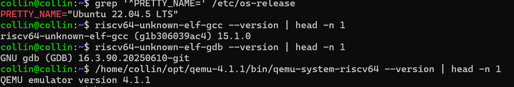
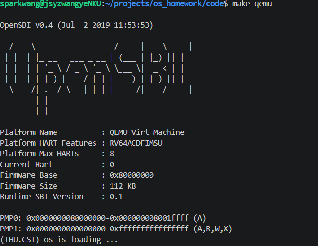
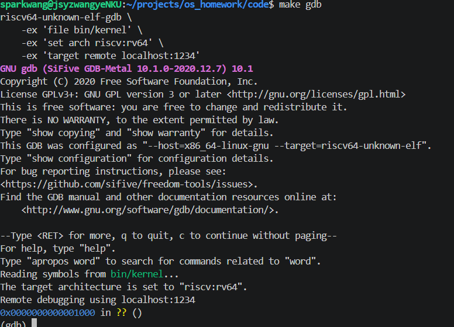
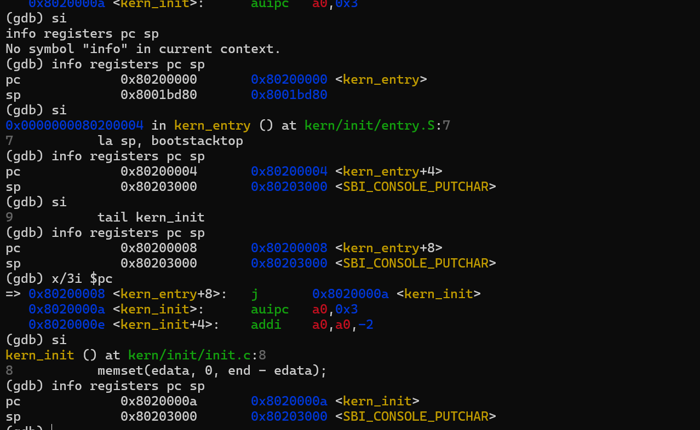
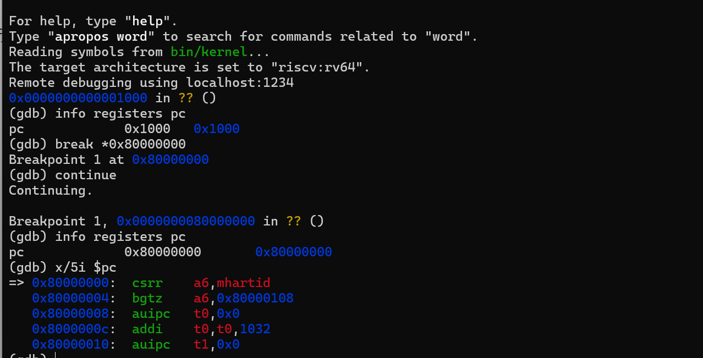
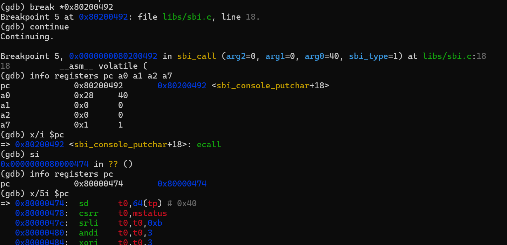

# 操作系统实验报告

## 实验基本信息

| 项目 | 内容 |
|------|------|
| 实验名称 | Lab 1: 比麻雀更小的麻雀（最小可执行内核）|
| 小组成员 | 2411795-阎科霖、2411294-王烨、2411276-林靖然 |
| 完成日期 | 2026-10-07 |

---

### 小组分工

练习分工：

| 成员 | 负责的练习/模块 |
|------|----------|
| 2411795-阎科霖 | 练习2与总结整理 |
| 2411294-王烨 | 练习1与前置准备 |
| 2411276-林靖然 | 练习1与练习2  |

实验报告分工：

| 成员 | 负责的练习/模块               |
|------|------------------------|
| 2411795-阎科霖 | 实验整体逻辑分析、实验内容与实现、实验总结与收获 |
| 2411294-王烨 | 实验目的、实验环境、实验整体逻辑分析、实验内容与实现 |
| 2411276-林靖然 | 实验整体逻辑分析、实验内容与实现 |

---

## 一、实验目的

本实验的主要目的是：

1. 使用链接脚本描述内存布局
2. 进行交叉编译生成可执行文件，进而生成内核镜像
3. 使用 QEMU 预加载内核镜像，理解复位代码经 OpenSBI 移交控制权到内核的过程
4. 使用OpenSBI提供的服务，在屏幕上格式化打印字符串用于以后调试

---

## 二、实验环境与运行

### 2.1 实验环境搭建及验证

本实验基于 WSL2 Ubuntu 22.04 开展，使用课程提供的 Lab1 代码进行编译与调试。由于开发环境采用 x86 架构，而实验内核运行在 RISC-V 架构上，因此需要使用 RISC-V 交叉编译工具链。

本次实验使用 QEMU 4.1.1 模拟 RISC-V 64 位计算机，并通过 OpenSBI v0.4 固件完成内核启动前的初始化。实验所使用的 Runtime SBI 版本为 0.1。

环境配置完成后，对 RISC-V 交叉编译工具链、GDB 及 QEMU 的版本进行检查，结果如图 2-1 所示。



从检查结果可以看到，相关工具均能够正常运行，QEMU 版本为 4.1.1，符合本次实验的环境要求。

### 2.2 工程编译与运行

首先进入 Lab1 工程目录，执行以下命令编译内核：

```bash
make
```

编译完成后，生成 ELF 格式的内核文件 `bin/kernel` 和原始二进制内核镜像 `bin/ucore.img`。其中，ELF 文件包含程序入口、符号等信息，可用于后续 GDB 调试；BIN 文件用于本次实验中的内核镜像加载。

随后使用 QEMU 4.1.1 运行内核：

```bash
make QEMU=/home/collin/opt/qemu-4.1.1/bin/qemu-system-riscv64 qemu
```

运行结果如图 2-2 所示。



从运行结果可以看到，OpenSBI v0.4 正常启动，固件基址为 `0x80000000`，Runtime SBI 版本为 0.1。在完成启动初始化后，CPU 进入 uCore 内核，并输出：

```text
(THU.CST) os is loading ...
```

这说明内核镜像能够正常运行，且控制台输出功能可以正常使用。由于 `kern_init()` 最后进入无限循环，程序不会自行退出，需要手动关闭 QEMU。

接下来使用 GDB 调试内核。首先在终端 1 中执行：

```bash
make QEMU=/home/collin/opt/qemu-4.1.1/bin/qemu-system-riscv64 debug
```

该命令使 QEMU 进入调试模式，开放 GDB 远程连接端口，并暂停 CPU 执行。

然后在终端 2 中进入相同的工程目录，执行：

```bash
make gdb
```

GDB 成功连接到 `localhost:1234` 后，可以读取 `bin/kernel` 中的符号信息，并查看当前 PC 及对应的汇编指令。连接结果如图 2-3 所示。



从调试结果可以看到，CPU 初始 PC 为 `0x1000`，与内核入口地址 `0x80200000` 不同。说明 CPU 并不是直接从内核入口开始执行，而是需要先经过复位代码和 OpenSBI 初始化。

至此，完成了内核的编译、运行和 GDB 调试环境验证。后续将结合工程源码及 GDB 单步执行结果，对内核入口、栈初始化和启动过程进行分析。

## 三、实验整体逻辑分析

### 3.1 内核的编译与启动流程

本实验基于课程提供的 uCore 最小内核框架，主要完成内核的编译、启动和调试，并分析其中涉及的关键代码。

首先，Makefile 调用 RISC-V 交叉编译工具链，将 C 语言和汇编源文件编译为目标文件，再根据 `tools/kernel.ld` 链接生成 ELF 文件 `bin/kernel`。随后使用 `objcopy` 将其转换为原始二进制镜像 `bin/ucore.img`，供 QEMU 加载。

内核的编译、加载与启动过程如下。

```text
C / 汇编源文件
       ↓
   交叉编译、汇编
       ↓
   目标文件（.o）
       ↓
   链接（kernel.ld）
       ↓
   bin/kernel（ELF）
       ↓
   objcopy
       ↓
   bin/ucore.img（BIN）
       ↓
   QEMU 预加载到 0x80200000

----------------------------

CPU 复位（PC = 0x1000）
       ↓
OpenSBI（0x80000000）
       ↓
kern_entry（0x80200000）
       ↓
设置内核栈
       ↓
kern_init()
       ↓
初始化数据、输出启动信息
       ↓
while(1)
```

其中，`kernel.ld` 指定内核的入口及内存布局，QEMU 在 CPU 开始执行前将内核镜像加载到指定地址。CPU 复位后，先运行复位代码和 OpenSBI 固件，再进入 uCore 内核。因此，内核的链接地址与 CPU 的初始执行地址并不相同。

本实验最终运行的是一个功能较简单的内核，启动后输出 `(THU.CST) os is loading ...`，随后进入无限循环。

### 3.2 主要文件及其作用

为了理解上述过程，我们阅读了实验工程中的几个关键文件，其主要作用如下。

| 文件 | 主要作用 |
|---|---|
| `Makefile` | 组织源码编译、链接、镜像生成及 QEMU 调试 |
| `tools/kernel.ld` | 指定内核入口地址，安排各个节的内存布局 |
| `kern/init/entry.S` | 设置内核栈，并跳转到 C 语言初始化函数 |
| `kern/init/init.c` | 完成静态数据清零、启动信息输出等操作 |
| `kern/libs/stdio.c` | 提供 `cprintf` 等格式化输出接口 |
| `libs/printfmt.c` | 负责解析格式字符串 |
| `kern/driver/console.c` | 封装控制台字符输出接口 |
| `libs/sbi.c` | 通过 SBI 接口向 OpenSBI 请求服务 |

在这些文件中，`kernel.ld` 和 `entry.S` 与内核的启动关系最为直接。

`kernel.ld` 将内核的链接起始地址设为 `0x80200000`，并通过 `ENTRY(kern_entry)` 指定程序入口。同时，链接脚本安排 `.text`、`.rodata`、`.data` 和 `.bss` 等节的位置，分别用于存放机器指令、只读数据、已初始化数据以及需要零初始化的数据。

CPU 进入 `kern_entry` 后，首先执行：

```asm
la sp, bootstacktop
tail kern_init
```

第一条指令将栈指针设置到预留的内核栈顶，第二条指令将执行权交给 `kern_init()`。本实验预留的内核栈大小为 8 KiB，栈顶地址为 `0x80203000`。

进入 `kern_init()` 后，程序首先通过 `memset(edata, 0, end - edata)` 处理需要清零的静态数据区域，再调用 `cprintf()` 输出启动信息。

本次编译得到的 `edata` 和 `end` 地址均为 `0x80203008`，所以实际清零长度为 0 字节。虽然本次没有非空区域需要清零，但这部分代码仍然保留了相应的初始化功能。

最后，`kern_init()` 进入 `while(1)`，使内核持续运行，不再返回入口汇编。

### 3.3 控制台输出的实现

本实验中的最小内核没有直接使用普通 C 程序的 `printf()`，而是通过工程提供的 `cprintf()` 实现格式化输出，并借助 OpenSBI 完成底层字符输出。

根据源码，主要调用过程为：

```text
cprintf()
    ↓
vcprintf()
    ↓
vprintfmt()
    ↓
cputch()
    ↓
cons_putc()
    ↓
sbi_console_putchar()
    ↓
sbi_call()
    ↓
ecall
    ↓
OpenSBI
```

其中，`cprintf()` 接收格式字符串和参数，`vprintfmt()` 负责解析格式并逐个输出字符。字符经过 `cputch()` 和 `cons_putc()` 后，最终交给 `sbi_console_putchar()`。

在本实验使用的 SBI 0.1 接口中，控制台字符输出的服务编号为 1。调用时，将服务编号放入寄存器 `a7`，将需要输出的字符放入 `a0`，再通过 `ecall` 请求 OpenSBI 处理。

这里的 `ecall` 并不是普通的函数调用，而是通过异常机制从 S 模式内核进入 M 模式固件，由 OpenSBI 完成相应操作。

在后续 GDB 调试中，我们也观察到了 `ecall` 指令及其执行后的地址变化，验证了这一调用过程。具体的断点设置、寄存器数值和执行结果将在第四章中进行分析。

---

## 四、实验内容与分析

### 4.1 练习 1：理解内核启动中的程序入口操作

本练习主要分析 `kern/init/entry.S` 中的入口汇编代码，理解内核栈初始化及程序入口跳转的作用。

入口代码如下：

```asm
#include <mmu.h>
#include <memlayout.h>

.section .text,"ax",%progbits
.globl kern_entry
kern_entry:
    la sp, bootstacktop
    tail kern_init

.section .data
.align PGSHIFT
.global bootstack
bootstack:
    .space KSTACKSIZE
.global bootstacktop
bootstacktop:
```

#### （1）`la sp, bootstacktop` 完成了什么操作？目的是什么？

`la` 是 RISC-V 的伪指令，用于将指定符号的地址加载到寄存器中。因此，`la sp, bootstacktop` 的作用是将栈顶地址写入栈指针寄存器 `sp`。

在本实验中，`bootstack` 和 `bootstacktop` 定义了一块 8 KiB 的内核栈空间，地址范围为 `0x80201000` 至 `0x80203000`。由于栈从高地址向低地址增长，因此初始 SP 应指向 `0x80203000`。

为了验证这一过程，我们在 GDB 中设置内核入口断点：

```gdb
break *0x80200000
continue
info registers pc sp
x/4i $pc
```

此时 CPU 停在 `kern_entry`，观察到：

```text
pc = 0x80200000
sp = 0x8001bd80
```

通过反汇编可以看到，本次编译生成的 `la sp, bootstacktop` 对应两条机器指令：

```asm
0x80200000: auipc sp,0x3
0x80200004: mv    sp,sp
```

随后使用 `si` 单步执行，并在每次执行后通过 `info registers pc sp` 检查寄存器。

观察结果如下：

| 执行阶段 | PC | SP |
|---|---|---|
| 进入 `kern_entry` | `0x80200000` | `0x8001bd80` |
| 第一次 `si` | `0x80200004` | `0x80203000` |
| 第二次 `si` | `0x80200008` | `0x80203000` |

第一次单步执行后，`auipc sp,0x3` 根据当前 PC 计算地址：

`0x80200000 + 0x3000 = 0x80203000`

因此 SP 被设置为内核栈顶。第二条指令 `mv sp,sp` 不改变寄存器的值，执行后 SP 仍为 `0x80203000`。

由此可以看出，`la sp, bootstacktop` 的主要目的是在进入 C 语言函数前，为内核建立独立的栈环境。后续的函数调用、局部变量及寄存器保存等操作可能需要使用栈空间，因此不能一直依赖之前固件使用的栈。

#### （2）`tail kern_init` 完成了什么操作？目的是什么？

`tail kern_init` 用于将程序执行权转移到 C 语言初始化函数 `kern_init()`。

与普通的 `call` 不同，`tail` 不会为本次跳转设置新的返回地址。本实验中的 `kern_init()` 最终进入 `while(1)` 无限循环，不需要返回入口汇编，因此使用 `tail` 比较合适。

从反汇编可以看到：

```asm
0x80200008: j 0x8020000a <kern_init>
```

继续使用 `si` 执行该指令后，GDB 显示：

```text
pc = 0x8020000a <kern_init>
sp = 0x80203000
```

这说明 CPU 已经成功进入 `kern_init()`，并且 SP 仍然保持为之前设置的内核栈顶。

完整的单步调试结果如图 4-1 所示。



综合以上结果，`entry.S` 主要完成两项操作：首先初始化内核栈，随后跳转到 C 语言初始化函数，为内核后续执行提供基本的运行环境。

---

### 4.2 练习 2：使用 GDB 验证启动流程

本练习通过 GDB 观察 RISC-V CPU 从复位地址开始执行，经过 OpenSBI 初始化，最终进入 uCore 内核的过程，并分析最初执行的几条指令。

#### （1）使用 GDB 调试内核启动过程

首先在终端 1 中启动 QEMU 调试模式：

```bash
make QEMU=/home/collin/opt/qemu-4.1.1/bin/qemu-system-riscv64 debug
```

该命令使用 QEMU 4.1.1，并通过 `-s -S` 参数开启 GDB 远程调试端口，同时暂停 CPU 执行。

随后在终端 2 中进入相同的工程目录，执行：

```bash
make gdb
```

GDB 读取 `bin/kernel` 中的符号信息，并连接到 QEMU 的 `localhost:1234` 调试端口。

**第一阶段：观察 CPU 复位地址**

连接成功后，使用以下命令检查 CPU 当前状态：

```gdb
info registers pc
x/5i $pc
```

观察到初始 PC 为 `0x1000`，该地址处的五条指令如下：

```asm
0x1000: auipc t0,0x0
0x1004: addi  a1,t0,32
0x1008: csrr  a0,mhartid
0x100c: ld    t0,24(t0)
0x1010: jr    t0
```

可以看出，CPU 并不是直接从内核入口 `0x80200000` 开始执行，而是先执行 QEMU 虚拟机器提供的复位代码。

这几条指令负责准备 OpenSBI 所需的启动参数，并跳转到固件入口。

**第二阶段：进入 OpenSBI**

接下来，在 OpenSBI 入口地址设置断点：

```gdb
break *0x80000000
continue
```

GDB 成功命中断点，再次检查 PC：

```text
pc = 0x80000000
```

此时反汇编显示，OpenSBI 入口处的第一条指令为：

```asm
0x80000000: csrr a6,mhartid
```

从复位地址到 OpenSBI 入口的调试结果如图 4-2 所示。



该结果说明 CPU 已经从复位代码进入 OpenSBI。随后由 OpenSBI 完成必要的初始化，并将执行权交给内核。

**第三阶段：进入 uCore 内核**

继续在内核入口地址设置断点：

```gdb
break *0x80200000
continue
```

GDB 成功停在 `kern_entry`，观察到：

```text
pc = 0x80200000 <kern_entry>
```

随后单步执行入口汇编，完成栈初始化并进入 `kern_init()`。这部分的 PC 和 SP 变化已经在练习 1 中验证，这里不再重复。

通过以上调试，可以确认本实验的启动过程为：

```text
CPU 复位：0x1000
        ↓
OpenSBI：0x80000000
        ↓
kern_entry：0x80200000
        ↓
kern_init：0x8020000a
```

需要注意，在本实验中，QEMU 已经提前将 `bin/ucore.img` 加载到 `0x80200000`。OpenSBI 主要负责初始化并移交执行权，并不是在运行过程中重新读取内核镜像文件。

#### （2）RISC-V 最初执行的指令位于什么地址？主要完成了哪些功能？

通过前面的 GDB 调试，可以确认在本实验使用的 QEMU 4.1.1 virt 平台中，CPU 从 `0x1000` 开始执行。

最初五条有效指令及其作用如下：

| 地址 | 指令 | 主要功能 |
|---|---|---|
| `0x1000` | `auipc t0,0x0` | 将当前 PC 作为地址计算的基准 |
| `0x1004` | `addi a1,t0,32` | 准备设备树地址参数 |
| `0x1008` | `csrr a0,mhartid` | 读取当前硬件线程的编号 |
| `0x100c` | `ld t0,24(t0)` | 读取下一阶段的固件入口地址 |
| `0x1010` | `jr t0` | 跳转到 OpenSBI 入口 |

其中，前四条指令主要完成地址和参数的准备，最后通过 `jr t0` 跳转到 OpenSBI。

因此，这几条指令并不是用来完成全部硬件初始化的，而是为 OpenSBI 的启动做好准备。具体的固件初始化操作由后续的 OpenSBI 代码完成。

这里的 `0x1000` 是当前 QEMU virt 平台使用的复位地址，并不代表所有 RISC-V 处理器都从相同地址启动。

#### （3）补充验证：SBI 控制台输出过程

在完成启动流程的调试后，我们还使用 GDB 观察了内核通过 SBI 输出字符的过程。

首先在 `sbi_console_putchar()` 函数处设置断点：

```gdb
break sbi_console_putchar
continue
```

程序成功停在该函数，GDB 显示当前字符参数为 `ch=40 '('`，与启动字符串 `(THU.CST) os is loading ...` 的第一个字符相同。

随后对 `sbi_console_putchar()` 进行反汇编，找到 `ecall` 指令的位置，并设置断点：

```gdb
break *0x80200492
continue
```

在执行 `ecall` 前，检查相关寄存器，得到以下结果：

| 寄存器 | 实际值 | 含义 |
|---|---|---|
| `pc` | `0x80200492` | 当前指令地址 |
| `a0` | `0x28` | 字符 `(` 的 ASCII 编码 |
| `a1` | `0` | 调用参数 |
| `a2` | `0` | 调用参数 |
| `a7` | `1` | SBI 控制台字符输出服务编号 |

此时 PC 指向的指令为：

```asm
0x80200492: ecall
```

接着执行一次 `si`，观察到：

```text
pc = 0x80000474
```

CPU 从内核地址 `0x80200492` 进入了 OpenSBI 所在的固件代码区域。

执行前后的调试结果如图 4-3 所示。



另外，在 GDB 中检查异常寄存器，得到：

```text
mcause = 9
mepc   = 0x80200492
```

其中，`mcause=9` 表示发生了由 S 模式发起的环境调用异常，`mepc` 则记录了触发异常的 `ecall` 指令地址。

结合单步调试结果，可以确认内核通过 `ecall` 请求 OpenSBI 提供控制台字符输出服务，而不是直接使用普通函数调用完成底层输出。

至此，本实验完成了从 CPU 复位、OpenSBI 启动、内核入口初始化到 SBI 输出机制的主要调试验证。

---

## 五、实验总结与收获

### 5.1 本实验的重要知识点及其与操作系统原理的联系

本次 Lab1 主要围绕最小内核的编译、启动和调试展开。通过阅读工程源码并使用 QEMU、GDB 进行验证，我们对操作系统启动前的准备工作，以及内核如何开始执行有了更具体的认识。

首先是**程序的编译、链接与加载**。实验通过链接脚本确定内核的内存布局，将源代码编译、链接为 ELF 文件，再转换为 BIN 镜像，由 QEMU 加载到指定位置。这一过程与操作系统原理中的程序装入、地址布局等知识有关。需要注意的是，链接阶段确定程序地址与操作系统运行时通过页表进行地址转换并不是同一回事，本实验也尚未实现内核自身的分页管理。

其次是**操作系统启动与特权级管理**。在 GDB 调试中，我们观察到 CPU 从 `0x1000` 开始执行，经过 OpenSBI 入口 `0x80000000`，最终进入 `0x80200000` 的内核入口。这说明内核并不是 CPU 复位后执行的第一段程序，而是需要先经过固件初始化，再获得执行权。实验中 OpenSBI 与 uCore 分别承担固件服务和内核运行的职责，也帮助我们理解了 RISC-V 不同特权级之间的关系。

此外，入口汇编中的 `la sp, bootstacktop` 与函数调用中的栈管理有关。通过单步调试，我们观察到 SP 从 `0x8001bd80` 变为 `0x80203000`，随后程序跳转到 `kern_init()`。这说明内核在执行 C 语言代码前，需要先准备好自己的栈空间。

最后是 **SBI 调用与异常处理机制**。本实验中的内核通过 `cprintf()` 输出字符串，底层使用 `ecall` 请求 OpenSBI 提供控制台服务。调试时，我们观察到执行 `ecall` 后 PC 从 `0x80200492` 转移到 `0x80000474`，并确认 `mcause=9`，说明发生了由 S 模式发起的环境调用异常。

这一过程与操作系统中的系统调用具有一定相似性，都是通过受控的异常机制请求其他执行环境提供服务。不过，本实验是 S 模式内核请求 M 模式固件，而通常的系统调用是用户程序请求操作系统内核，两者并不完全相同。

### 5.2 操作系统原理中尚未涉及的知识点

虽然本实验展示了一个最小内核的启动过程，但距离完整的操作系统还有很大差距。

首先是**进程管理与调度**。本实验中的 `kern_init()` 完成初始化和输出后便进入无限循环，没有创建进程，也没有实现进程切换。因此，操作系统中涉及的进程状态、上下文切换、并发执行和调度算法等内容，在本次实验中都没有体现。

其次是**内存管理**。本实验使用链接脚本安排内核的基本内存布局，并在启动时设置内核栈，但尚未实现完整的虚拟内存管理，也没有涉及页表建立、地址空间隔离以及内存分配等功能。

此外，本实验只通过 OpenSBI 实现了简单的字符输出，没有实现完整的设备驱动、文件系统及面向用户程序的系统调用接口。这些功能需要在后续实验中逐步补充。

### 5.3 实验收获

本次实验虽然没有要求实现复杂的内核功能，但让我们对操作系统从编译完成到实际运行的过程有了更清楚的认识。

其中，比较重要的收获是区分了链接地址、镜像加载地址和 CPU 复位地址，并通过 GDB 观察了内核栈初始化、程序入口跳转及 SBI 调用的实际执行过程。

相比单纯阅读源码，通过断点和单步调试能够更直观地理解汇编指令与寄存器之间的关系，也为后续学习中断处理、内存管理和进程调度等内容打下了基础。

---

